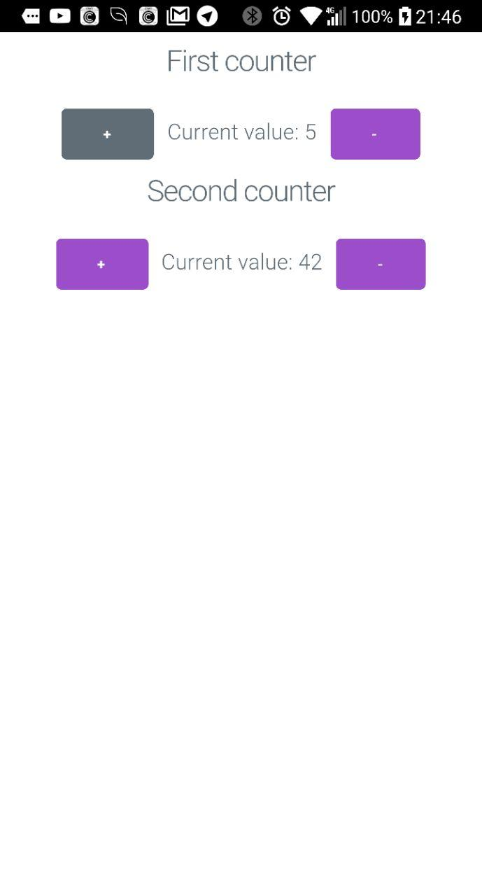

It is example of [reflex-dom](https://github.com/reflex-frp/reflex-dom) application that can be build with GHCJS and as Android and iOS applicatons.

Online demo is located [here](https://ncrashed.github.io/reflex-dom-mobile/).



# How to build and develop

See [reflex-platform documentation](https://github.com/reflex-frp/reflex-platform/blob/develop/docs/project-development.md#building-with-nix)  about nix scripts that perform environment
and build management.

Bellow I describe how to perform typical actions to build and develop the project. Prerequisites are:
* You have to install [nix](https://nixos.org/nix/)
* You have to build under MacOS to compile iOS native application or configure nix distrubted build.
* For NixOS users: configure binary cache from [reflex-platform](https://github.com/reflex-frp/reflex-platform/blob/develop/notes/NixOS.md) to avoid very long builds of tools. Non NixOS users should get binary cache for free.

# Building backend

Backend is simple [Warp](http://hackage.haskell.org/package/warp) that serves HTTP/JS from `app-front/statics`.

## One shot build

To build server:
```
nix-build -A ghc.app-back
```
Result is placed in `result` symlink.

## Development

The following instructions allow to build backend incrementally.

* Enter GHC environment, where all dependencies for backend and frontend are configured to use GHC:
```
nix-shell -A shells.ghc
```
* Compile with `cabal new-build`:
```
cd app-back
cabal new-build exe:app-back
```
* Run result with `server.sh` script.

* You can use `ghcid` for hot recompilation:
```
ghcid -c "cabal new-repl lib:app-back"
```
Or for executable:
```
ghcid -c "cabal new-repl exe:app-back"
```

# Building frontend for desktop

Frontend assembles with [Webkit-Gtk](https://webkitgtk.org/) when compiled with GHC environment.

## One shot build

To build desktop frontend:
```
nix-build -A ghc.app-front
```

Result is placed in `result` symlink. You can run it simply as:
```
./result/bin/app-front
```

## Development

The following instructions allow to build frontend incrementally.

* Enter GHC environment, where all dependencies for backend and frontend are configured to use GHC:
```
nix-shell -A shells.ghc
```
* Compile with `cabal new-build`:
```
cd app-back
cabal new-build exe:app-front
```
* Run result with `cabal new-run exe:app-front`.

* You can use `ghcid` for hot recompilation:
```
ghcid -c "cabal new-repl lib:app-front"
```
Or for executable:
```
ghcid -c "cabal new-repl exe:app-front"
```

# Building frontend for web browser

Frontend is compiled to raw JS when compiled with GHCJS environment.

## One shot build

Non optimized build:
```
nix-build -A ghcjs.app-front
```
Optimize with [closure compiler](https://github.com/google/closure-compiler):
```
nix-build -A ghcjs.app-front --arg minimize true
```
Result is located in `result/bin/app-front.jsexe/all.js` and `result/bin/app-front.jsexe/all.min.js.gz` for optimized result.

## Development

The following instructions allow to build frontend incrementally.

* Enter GHC environment, where all dependencies for backend and frontend are configured to use GHCJS:
```
nix-shell -A shells.ghcjs
```
* Compile with `cabal new-build`:
```
cd app-front
./build.sh
```
* In backend environment run server with `./serve.sh` script in `app-back` folder as current.
* Now open `http://127.0.0.1/index.html` in your browser.

# Building frontend for Android

Build apk with:
```
nix-build -A android.app-front -o android-result
```
Upload `android-result/android-app-debug.apk` to device manually or by `android-result/bin/deploy`.

## Notes for Android

You can use native functions of Android system, see [the entry module](https://github.com/reflex-frp/reflex-dom/blob/develop/reflex-dom/src-android/Reflex/Dom/Android/MainWidget.hsc) and [bindings for activies](https://github.com/obsidiansystems/android-activity/blob/develop/src/Android/HaskellActivity.hsc).

# Building frontend for iOS

Build with:
```
nix-build -A ios.app-front -o ios-result
```
Note: you need to perform it with [nix distributed builds](https://nixos.org/nix/manual/#chap-distributed-builds) configured or on MacOS in the first place.
